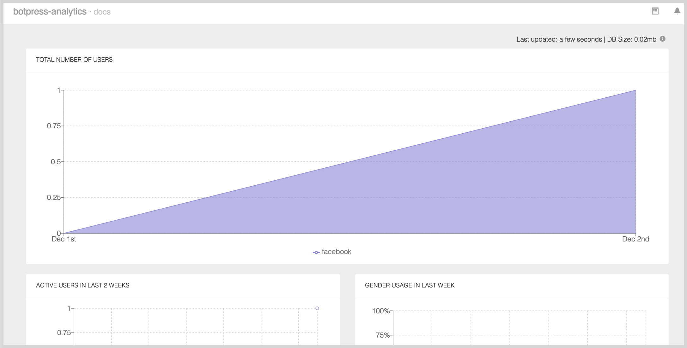
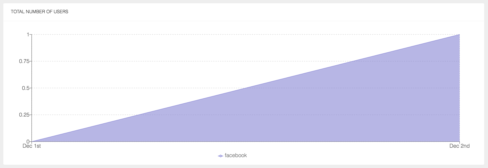
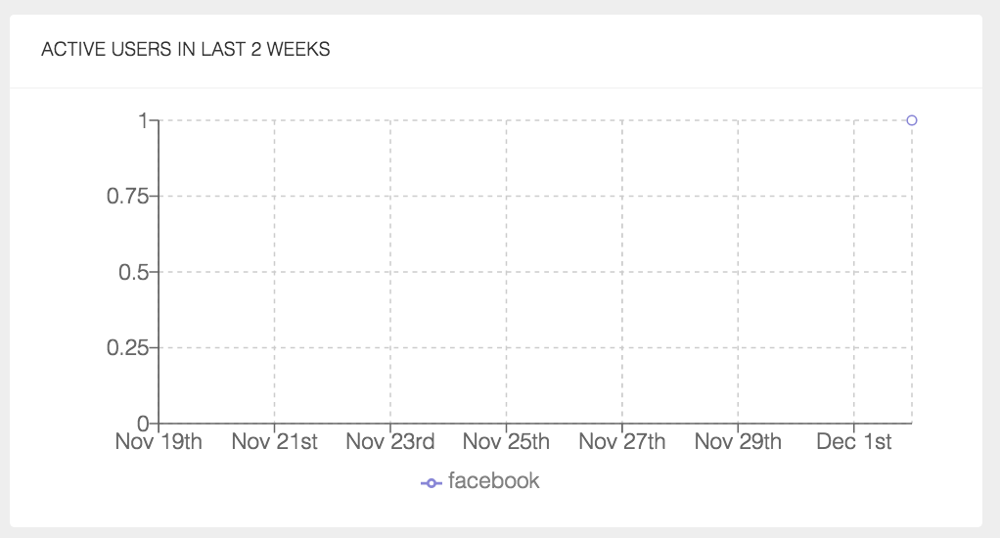
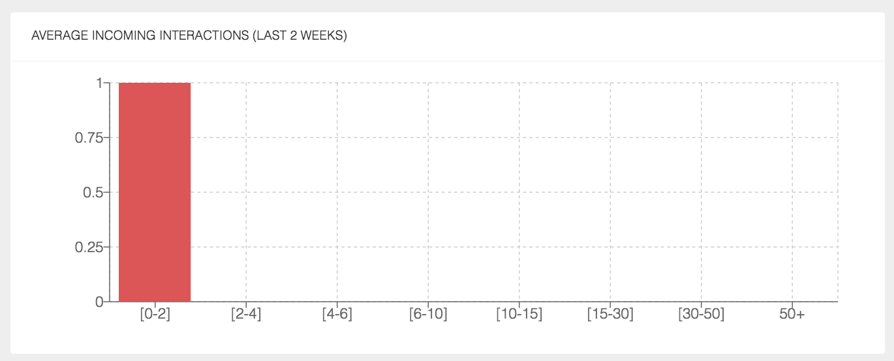
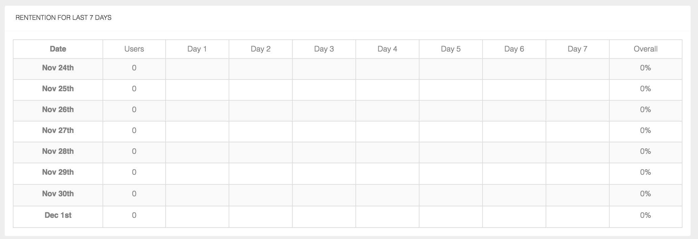
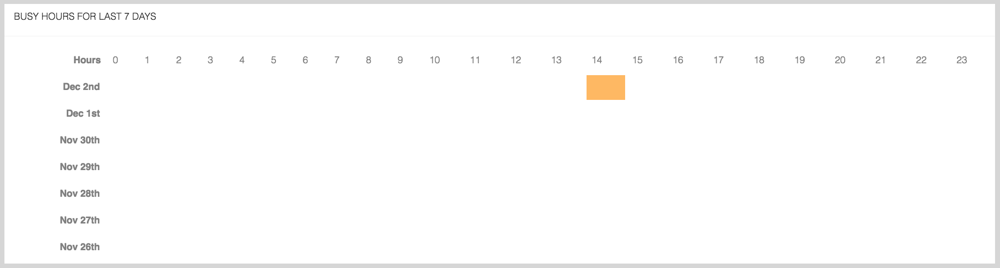

# @botpress/analytics

Analytics for Botpress provides an interface to view graphs and data of your chatbot typical usage. By using this module, you can have a look to your total users, retention, daily active users, busy hours and a lot more...



**Note**: All graphic captures have been taken on an empty bot then it's not looking pretty well... Pull requests would be appreciate to show full potential of this module on a real chatbot.

## Get started

```
botpress install analytics
```

The analytics module should now be available in your bot UI, you can access all graphs and data directly in the UI.

## Features

### Total number of users

You can see graphically your total number of users per platform and compare results to know exactly where to focus your attention.



### Gender usage in last week

Analytics module offers a view of your gender usage which can be useful to increase engagement of women or men.


### Active users in last 2 weeks

You can visually see your active users for the last 2 weeks which can indicate you progression and active days.



### Average incoming interactions

This graphic helps to quickly view what is the average of incoming interactions your users typically have in a day with your bots.



### Insights

These specific metrics might be useful to see average usage of your bots.


### Retention for last 7 days

You can see exactly see your retention by days in this table.



### Busy hours for last 7 days

Analytics module also offer a view of busy hours of your bot which can help you to track exactly when it's the time to send them messages.



## Community

Pull requests are welcomed! We believe that it takes all of us to create something big and impactful.

There's a [Slack community](https://slack.botpress.io) where you are welcome to join us, ask any question and even help others.

Get an invite and join us now! 👉[https://slack.botpress.io](https://slack.botpress.io)

## License

botpress-analytics is licensed under [AGPL-3.0](/LICENSE)
